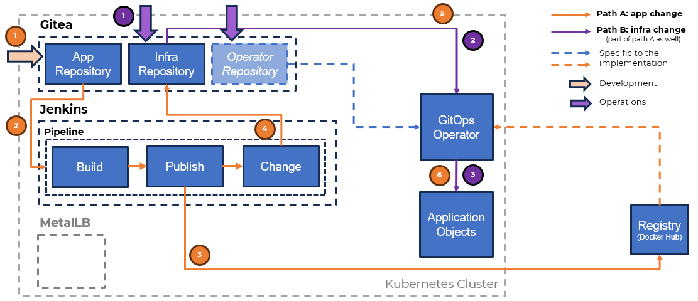

# GitOps and Kubernetes

A presentation for DEV.BG Community Day, 21.06.2025.

Ideally, all the demo steps/parts should be executed. This way, the user will have a basis (a thin one) for comparison between two of the most popular **GitOps** tools - **ArgoCD** and **FluxCD**.

Realistically, pick just the parts that make sense in the current situation. :)

## Supporting files

Files are provided in the following structure:

* *demo* folder contains the actual demo steps

* *slides.pdf* file contains the slides of the presentation

## Requirements

A station with installed ***kubectl*** and ***helm*** binaries, and access to ***one*** Kubernetes cluster. 

From a workload/component point of view, the demo environment configuration looks like this:

The actual demonstration uses a single all-in-one Kubernetes cluster created with ***minikube***. Of course, another setup, either on-premises or in the cloud, could be used. Depending on the difference, the demo script/steps may need some adjustment.

## Related content

This repository is part of a pack of three repositories. The other two are: 

* **GitOps and Kubernetes: Demo App** *(the application repository)* - <https://github.com/shekeriev/gitops-and-k8s-demo-app>

* **GitOps and Kubernetes: Demo App Infra** *(the infrastructure repository)* - <https://github.com/shekeriev/gitops-and-k8s-demo-app-infra>

## Related content on similar topics

There are a few other related repositories of mine:

* **First Steps with Kubernetes** *(held on 11.02.2021 at SoftUni)* - <https://github.com/shekeriev/softuni-k8s-seminar>

* **A Short Introduction to Kubernetes** *(evolved during time)* - <https://github.com/shekeriev/k8s-intro>

* **The Journey to VMware Tanzu** *(a three part webinar)* - <https://github.com/shekeriev/journey-vmware-tanzu>

* **Kubernetes Network Policies** *(held on 07.01.2022 at DEV.BG)* - <https://github.com/shekeriev/k8s-netpol>

* **Monitoring Kubernetes Clusters** *(held on 30.07.2024 at DEV.BG)* - <https://github.com/shekeriev/monitoring-k8s-clusters>

## Need training?

Feel free to contact [me](https://www.linkedin.com/in/dzahariev/) if you or the company you work for needs training on this or related topics.